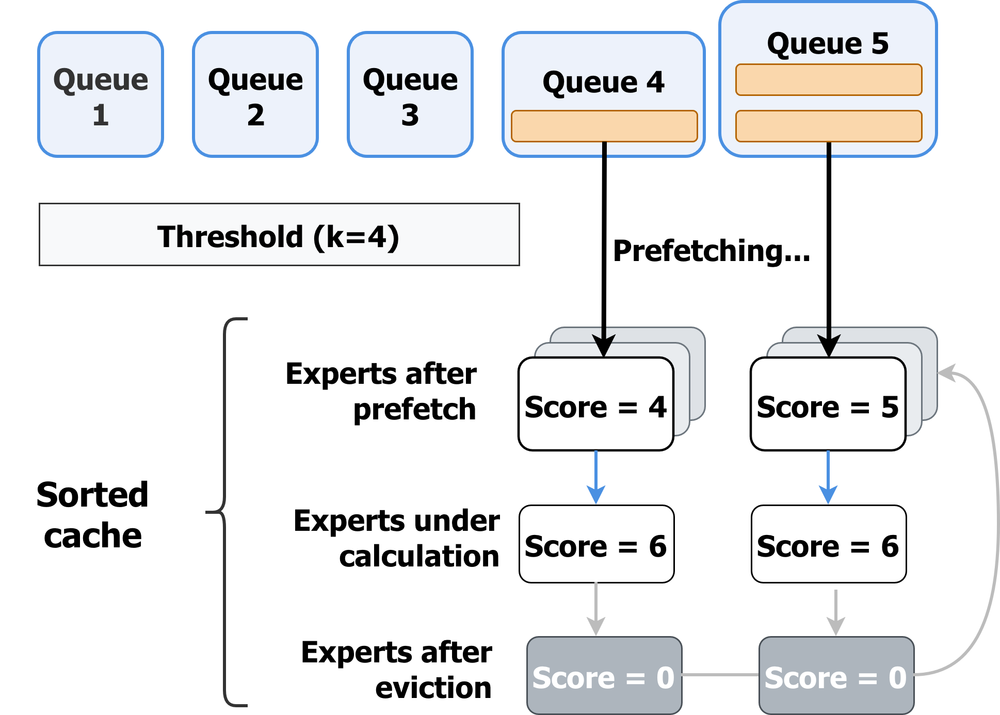
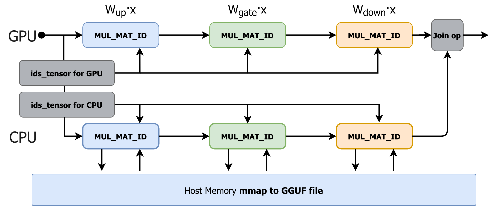

# MoE-SpAc
<p align="center">
 | <a href="https://arxiv.org/pdf/2603.09983"><b>Arxiv Preprint</b></a> |
   <a href="https://huggingface.co/papers/2603.09983"><b>Huggingface Preprint</b></a> |
</p>

Mixture-of-Experts (MoE) models enable scalable performance but face severe memory constraints on edge devices. Existing offloading strategies struggle with I/O bottlenecks due to the dynamic, low-information nature of autoregressive expert activation. In this paper, we propose to repurpose Speculative Decoding (SD) not merely as a compute accelerator, but as an informative lookahead sensor for memory management, supported by our theoretical and empirical analyses. Hence, we introduce MoE-SpAc, an MoE inference framework that integrates a Speculative Utility Estimator to track expert demand, a Heterogeneous Workload Balancer to dynamically partition computation via online integer optimization, and an Asynchronous Execution Engine to unify the prefetching and eviction in the same utility space. Extensive experiments on seven benchmarks demonstrate that MoE-SpAc achieves a **42%** improvement in TPS over the SOTA SD-based baseline, and an average **4.04x** speedup over all standard baselines.

## Implementation Based on llama.cpp

Scheduling and cache management of the MoE-SpAc in implementation when K = 5.


MoE-SpAc implementation atop llama.cpp, unchanged operators is omitted. This figure focuses on the MoE calculation part.
### Modified Files
```
 .gitignore                       |   1 +
 README.md                        |  68 ++++++++++++++++
 convert_hf_to_gguf.py            |  25 +++++-
 ggml/include/ggml-backend.h      |  13 +++-
 ggml/include/ggml.h              |   8 ++
 ggml/src/ggml-backend.cpp        | 690 ++++++++++++++++++++++++++++++++++++++++++++++++++++++++++++++++++++++++++++++++++++++++++++++++++++++++++++++++++++++++++++++++++++++++++++++++++++++++++++-----
 ggml/src/ggml-cpu/binary-ops.cpp |   9 +++
 ggml/src/ggml-cpu/binary-ops.h   |   1 +
 ggml/src/ggml-cpu/ggml-cpu.c     |  34 ++++++--
 ggml/src/ggml-cuda/ggml-cuda.cu  | 134 ++++++++++++++++++++++++--------
 ggml/src/ggml-cuda/mmvf.cu       |   1 +
 ggml/src/ggml.c                  |  23 +++++-
 gguf-py/gguf/constants.py        |   6 ++
 gguf-py/gguf/tensor_mapping.py   |  16 ++++
 include/llama.h                  |   2 +
 src/llama-arch.cpp               |  10 +++
 src/llama-arch.h                 |   4 +
 src/llama-context.cpp            |  27 +++++++
 src/llama-graph.cpp              |  86 +++++++++++++++++++-
 src/llama-graph.h                |  24 ++++++
 src/llama-model-loader.h         |   1 +
 src/llama-model.cpp              |  35 ++++++++-
 src/llama-model.h                |   3 +
 tools/server/server.cpp          |  11 +++
 24 files changed, 1166 insertions(+), 66 deletions(-)
```

## Models Support
- [x] Qwen-3 Series (easily adapted to Qwen-2 Series)
- [x] DeepSeek-V2 Series (easily adapted to DeepSeek-V3 Series)
- [ ] GLM Models
- [ ] Kimi Models

## Quick start
1. Set env
```bash
source .venv/bin/activate

export PATH=$CUDA_HOME/bin:$PATH \
        LD_LIBRARY_PATH=$CUDA_HOME/lib64:$LD_LIBRARY_PATH \
        CUDA_VISIBLE_DEVICES=[Available Device ID]
```
2. CMake build and compile
```bash
cmake -B build \
    -DGGML_CUDA=ON \
    -DCMAKE_CUDA_COMPILER=./dir/to/cuda_compiler \
    -DCUDAToolkit_ROOT=./dir/to/cuda_tkit \
    -DCMAKE_BUILD_TYPE=Release    
    
cmake --build build --config Release -j$nproc
```

## Run the server
1. Modify some parameter for your model.
    1. `#define GGML_MAX_EXPERTS_NUM    1000` and `#define GGML_MAX_PREFETCH_NUM   1024` in `ggml/include/ggml.h`
    2. `#define NLAYERS 48` and `#define NEXPERTS 128` in `ggml/src/ggml-backend.cpp`
1. Add mapping in `LLM_TENSOR_NAMES` in file `src/llama-arch.cpp`:
    ```cpp
    { LLM_TENSOR_PREFETCH_GATE_EXPS, "model.prefetch.gate_proj" },
    { LLM_TENSOR_PREFETCH_DOWN_EXPS, "model.prefetch.down_proj" },
    { LLM_TENSOR_PREFETCH_UP_EXPS,   "model.prefetch.up_proj" },
    ```
1. Add `prefetch_wgt` in file `src/llama-model.cpp`
    ```cpp
    {
        const int64_t n_ff_exp = hparams.n_ff_exp ? hparams.n_ff_exp : n_ff / n_expert_used;
        const int64_t n_prefetch_experts = ; // Number of experts that can be prefetched
        prefetch_gate_wgt = create_tensor(tn(LLM_TENSOR_PREFETCH_GATE_EXPS, "weight"), {n_embd, n_ff_exp, n_prefetch_experts}, 0);
        prefetch_down_wgt = create_tensor(tn(LLM_TENSOR_PREFETCH_DOWN_EXPS, "weight"), {n_ff_exp, n_embd, n_prefetch_experts}, 0);
        prefetch_up_wgt =   create_tensor(tn(LLM_TENSOR_PREFETCH_UP_EXPS,   "weight"), {n_embd, n_ff_exp, n_prefetch_experts}, 0);
    }
    ```
1. Modify the `data_stack` in `convert_hf_to_gguf.py` according to your VRAM capacity
    ```python
    data_stack = torch.cat([data_torch] * '''Put the number''', dim = 0)
    ```
2. Generate a new GGUF file, 
    ```bash
    python convert_hf_to_gguf.py \
        ./directory/to/hf_weight \
        --outtype f16 --verbose \
        --outfile [output file]
    ```
3. Run the demo
    ```bash
    ./build/bin/llama-speculative \
        -m ${DS_GGUF}/deepseek_v2_target.gguf \
        -md ${DS_GGUF}/deepseek_v2_draft.gguf \
        -p "// Quick-sort implementation in C (4 spaces indentation + detailed comments) and sample usage:\n\n#include" \
        -e -ot "\\.ffn_(up|down|gate)_exps"=CPU -n 512 \
        -c 4096 -s 8 --draft 8 
    ```
4. Use the server as a client. Reference: https://rustman.dev/blog/chat-with-llama.cpp
    ```bash
    ./build/bin/llama-server \
        -m  ${QWEN_GGUF}/[verification model] \
        -md ${QWEN_GGUF}/[draft model] \
        -ot "\\.ffn_(up|down|gate)_exps"=CPU -n 512 \
        -fa auto --port 8033 -c 4096 \
        --draft-max 8 -s 42
    ```


# Acknowledgement
Great thanks to [llama.cpp](https://github.com/ggml-org/llama.cpp)
